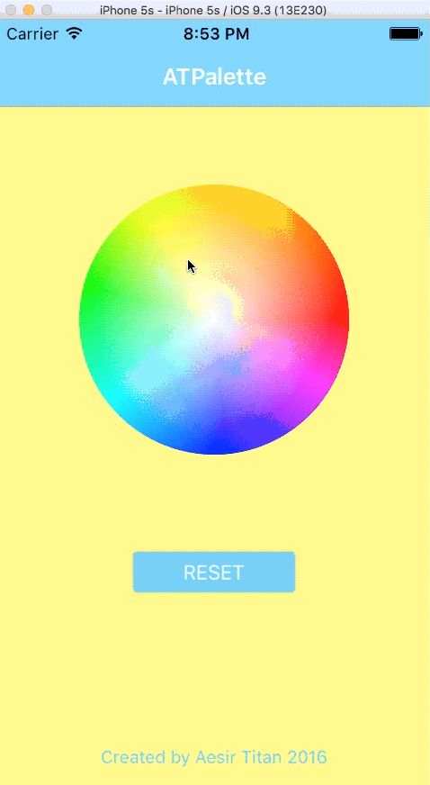

# ATPalette

[](https://travis-ci.org/Aesir/ATPalette)
[](http://cocoapods.org/pods/ATPalette)
[](http://cocoapods.org/pods/ATPalette)
[](http://cocoapods.org/pods/ATPalette)




## 安装

下载并解压压缩包,将"UIImageView+GetColorAtPixel/"文件夹下面的两个文件拖入项目中即可.


## 导入

在需要使用的控制器中导入头文件

```objective-c
#import "UIImageView+GetColorAtPixel.h"
```

## 示例代码

传入一个point,返回一个color
```objective-c
// 从UIImageView中获取指定点的UIColor对象
// - (UIColor *)getColorAtPixel:(CGPoint)point;
UIColor *color = [self.palette getColorAtPoint:point];
```
如果触摸点的位置超出了图片,会返回nil,显示出来是黑色,

为了防止出现这种情况,可以简单地封装一下使用:


```objective-c
-(void)touchesBegan:(NSSet<UITouch *> *)touches withEvent:(UIEvent *)event{

    UITouch *touch = [touches anyObject];
    CGPoint point = [touch locationInView:self.palette];

    // set background color of view
    // 设置视图背景颜色
    [self getColorAtPoint:point completion:^(UIColor *color) {
        self.view.backgroundColor = color;
    }];

}


// Access to the specified pixel color, and perform operations
// 获取指定像素点的颜色, 并执行操作
- (void)getColorAtPoint:(CGPoint)point completion:(void(^)(UIColor *color))completion{

    CGFloat x = point.x - 0.5*self.palette.frame.size.width - 1;
    CGFloat y = point.y - 0.5*self.palette.frame.size.height - 1;
    CGFloat r = 0.5 * (self.palette.frame.size.width - 20);

    // When the touch point is inside palette coordinates.
    // 当触摸点在取色板内部时调用
    if (powf(x,2) + powf(y, 2) < powf(r, 2)) {
        completion([self.palette getColorAtPixel:point]);
    }

}
```


## Author

AesirTitan, ayan.bifrost@gmail.com
